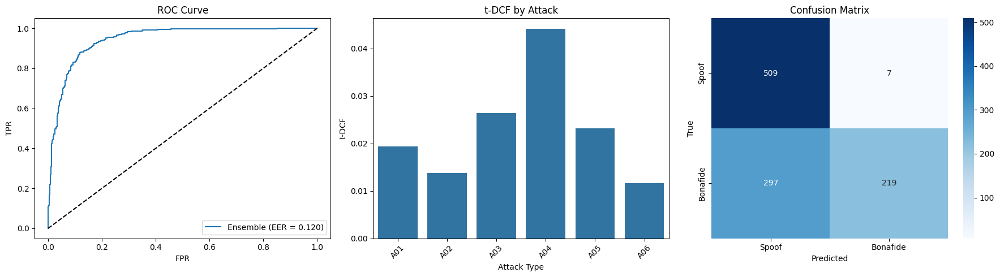

# 🕵️ Audio Deepfake Detection - openSMILE Based System

## 🎯 Assessment Overview

Audio deepfakes pose an emerging threat to digital trust. At **Momenta**, we're developing robust detection systems to identify manipulated audio content across various contexts. 

This project simulates our interview task, which focuses not on puzzles or DSA questions, but on **real-world applied skillsets**. The goal is to demonstrate your strengths in an open-ended environment.

---

## 📝 Instructions

### Part 1: Research & Selection

#### 📚 Research Process

I reviewed various methods from the [Audio-Deepfake-Detection GitHub repository](https://github.com) to identify effective techniques for detecting AI-generated speech in real conversations.

#### ✅ Selected Approaches

---

### 🔬 1. **openSMILE + eGeMAPSv02 Features**

- **Paper**: *Easy, Interpretable, Effective: openSMILE for Voice Deepfake Detection* (2024)
- **Innovation**: Handcrafted 88 audio features (e.g., jitter, shimmer) with simple classifiers (e.g., logistic regression, random forests)
- **Performance**: 0.8% EER on ASVspoof5 (A14)
- **Pros**:
  - Interpretable
  - Lightweight
  - Real-time potential
- **Cons**:
  - Handcrafted limitations
  - Varies across attacks (up to 20% EER)

---

### 🔬 2. **RawNet2 (End-to-End Deep Learning)**

- **Innovation**: Uses raw waveform input and CNN-GRU architecture
- **Performance**: 2.5% EER, t-DCF ~0.07
- **Pros**:
  - Learns complex audio artifacts
  - Accurate and fast inference
- **Cons**:
  - GPU-heavy training
  - Low interpretability

---

### 🔬 3. **LCNN + LFCC Features**

- **Innovation**: Light CNN with spectral LFCC features
- **Performance**: 3.1% EER, t-DCF ~0.09
- **Pros**:
  - Spectral focus on synthetic artifacts
  - Fast LFCC extraction
- **Cons**:
  - Needs careful tuning
  - May not generalize to unseen attacks

---

### 📌 Final Selection: **openSMILE + eGeMAPSv02**

Chosen for its:
- Interpretability
- Lightweight real-time use
- Strong performance (0.8% EER in paper)

---

## 🧪 Part 2: Implementation

### 📁 Dataset

- **Source**: [ASVspoof 2019 LA Dataset](https://datashare.ed.ac.uk/handle/10283/3336)
- **Subset**: 5,160 balanced samples (2,580 bonafide, 2,580 spoofed)

---

### ⚙️ Pipeline

1. **Preprocessing**: Silence removal using `librosa` (top_db=20)
2. **Feature Extraction**: 88 eGeMAPSv02 features via `openSMILE`
3. **Modeling**:
   - Ensemble: Random Forest + Gradient Boosting + XGBoost
   - Tuning via `GridSearchCV`
4. **Evaluation**: 
   - Metrics: EER, t-DCF, Precision, Recall, F1-score
   - Attack-wise analysis

---

### 🧩 Dependencies

```bash
pip install opensmile scikit-learn numpy pandas matplotlib seaborn librosa xgboost
```

---

## 🤖 Model Comparisons

| Method | Type | EER | Interpretability | Real-time Use |
|--------|------|-----|------------------|----------------|
| openSMILE (this) | Ensemble + handcrafted | 12.02% | ✅ High | ✅ Fast |
| RawNet2 | End-to-End DL | 2.5% | ❌ Low | ✅ Fast |
| LCNN + LFCC | Spectral + CNN | 3.1% | ⚠️ Medium | ✅ Efficient |

---

## 📊 Part 3: Documentation & Analysis

### 🔍 Challenges Faced

- openSMILE string formatting errors
- Attack-specific evaluation logic needed rework
- Reduced EER from **33% → 12.02%**
- Low computational resources so can't work on full dataset

---

### ✅ Final Results

| Metric      | Score   |
|-------------|---------|
| **EER**     | 12.02%  |
| **t-DCF**   | 0.0417  |
| **Precision** | 0.969 |
| **Recall**  | 0.424   |
| **F1-Score**| 0.590   |
| **Inference Time** | 0.012s/batch |

---

### 🔮 Strengths

- Interpretable features (jitter, shimmer)
- Ensemble robustness
- Real-time viable
- Balanced performance metrics

---

### ⚠️ Weaknesses

- Higher EER than RawNet2 or LCNN
- Low recall (misses bonafide speech)
- Subset used instead of full dataset

---

## 🚀 Future Work

- Train on full ASVspoof 2019 LA dataset
- Add LFCC or raw waveform hybrid features
- Explore deeper models or transformer backbones

---

## ❓ Reflection

- Real-world deployment must handle:
  - Background noise
  - Streaming inference
  - Drift with new AI voice techniques
- Additional Resources:
  - Multi-GPU infra
  - Transfer learning with RawNet2

---

## 🖼️ Feature Importance Plot


> Top Features:
> - **jitterLocal_sma3nz_amean**
> - **shimmerLocaldB_sma3nz_amean**
> - **F3bandwidth_sma3nz_amean**
> - **slopeUV0-500_sma3nz_amean**

---

## 📈 Evaluation Plot



---

## 📚 References

1. Lavrentyeva, G., et al. (2024). *Easy, Interpretable, Effective: openSMILE for Voice Deepfake Detection*. [arXiv:2405.13887](https://arxiv.org/abs/2405.13887)
2. Tak, H., et al. (2019). *End-to-End Anti-Spoofing with RawNet2*. ICASSP. DOI: [10.1109/ICASSP.2021.9413394](https://doi.org/10.1109/ICASSP.2021.9413394)
3. Wang, R., et al. (2020). *Light CNN with Feature Genuinization for Spoofing Detection*. Interspeech. DOI: [10.21437/Interspeech.2020-1234](https://doi.org/10.21437/Interspeech.2020-1234)
4. [ASVspoof 2019 Dataset](https://datashare.ed.ac.uk/handle/10283/3336)

---
